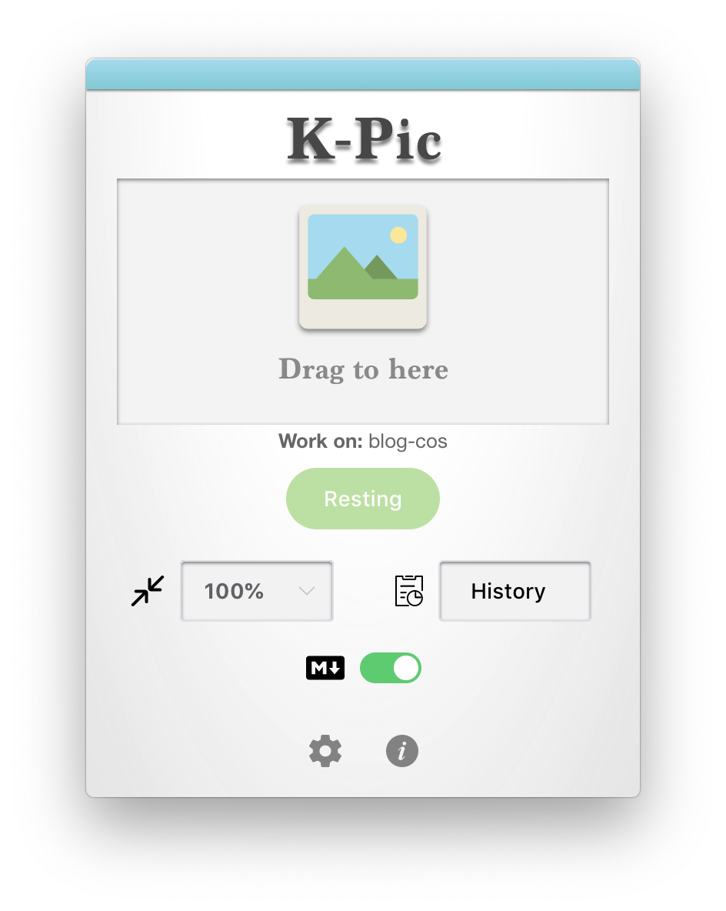

<div align="center"><p>
    <span style="font-size: 14px">Version: 0.1.1</span><br>
    <span>"A Simple Cloud Image Storage GUI Uploader"</span><br>
    <span stylt="font-size: 10px;color= #95dafc">Kevin T. Lee</span>
    </p>
    <a href="./LICENSE"></a>
        <a href="http://lidengju.com"></a>
    <a href="https://github.com/kevinleeex/K-pic/releases"></a>
</div>


# K-pic

This is a simple cloud image uploader GUI tool. (Not only for the images in fact)

*Currently, only the Mac version of the application has been tested.

## Features

- [x] 🍞 Supporting the services below:
   - [x] Tencent COS
   - [ ] AliYun OSS
   - [ ] QiNiu Cloud Storage
   - [ ] Amazon S3
   - [ ] Weibo Image Storage 
- [x] 🍔 Drag & Drop to upload
  - [x] Upload through window
  - [x] Upload through system tray icon
- [x] 🍟 Multi-languages supported 
  - [x] English
  - [x] Simplified Chinese
  - [x] Traditional Chinese
- [x] 🍕 Auto-update
- [ ] 🥪 Upload history
- [ ] 🍜 Image pre-process

## Release Notes

See [K-pic Releases](https://github.com/kevinleeex/K-pic/releases)

## Previews



## Getting Started

The following instructions will guide you to employ the project and to run on your own system.

### Prerequisites

The following softwares you should installed before build the project.

- node.js
- npm (or yarn)

### Installation

Clone the project.

```shell
cd path-to-dir
git clone https://github.com/kevinleeex/K-pic.git
```

Install the dependencies.

```shell
npm install
or
yarn install
```

> yarn command is recommended as you could use ``` yarn autoclean``` to reduce the size of the package.

### Deployment

Run the app with development mode.

```shell
npm run dev
or
yarn run dev
```

Build the project for cross-platform.

```bash
npm run build:all  # build for cross-platform
npm run build  # build for current platform
npm run build:win  # build for windows
npm run build:linux  # build for linux
npm run build:dir  # fast build a app in directory
# [npm] above can be replaced with [yarn].
```

Release the app you build.

> Before this operation, you should set the GitHub Token ```GH_TOKEN``` for getting access to your repository.

```shell
npm run build:rmac  # release mac version app
```

## Powered By

- [Electron](https://electronjs.org/) - The cross-platform desktop application building tool with web development techs.
- [Vue.js](https://vuejs.org/) - The Progressive JavaScript Framework.
- [Electron-Vue](https://github.com/SimulatedGREG/electron-vue) - The boilerplate for making electron applications built with vue.
- [Vue-CLI](https://cli.vuejs.org/) - Standard Tooling for Vue.js Development.
- [Electron-json-storage](https://github.com/electron-userland/electron-json-storage) - Easily write and read user settings in Electron apps.
- [Vue Router](https://router.vuejs.org/) - Vue Router is the official router for [Vue.js](http://vuejs.org/)
- [Vuex](https://vuex.vuejs.org/) - Vuex is a state management pattern + library for Vue.js applications.
- [Element-UI](https://element.eleme.io/) - A Desktop UI Library.

I would like to extend my sincere gratitude to the authors and contributors of the open source libraries above.

## Support me

If this project helps you, you can support me to do better.  
<a href="https://paypal.me/kevinleeex"></a>

Or click <a href="http://lidengju.com/donate">Donete me</a> with Wechat or Alipay

## TO-DO

- [ ] Form validation
- [ ] Support more services
- [ ] Image pre-process
- [ ] History management
- [ ] Touch bar support on Mac

## License

Copyright © 2018 [Kevin T. Lee](http://lidengju.com). All rights reserved. 

The project is licensed under the MIT license. See [LICENSE](./LICENSE) for more details.
